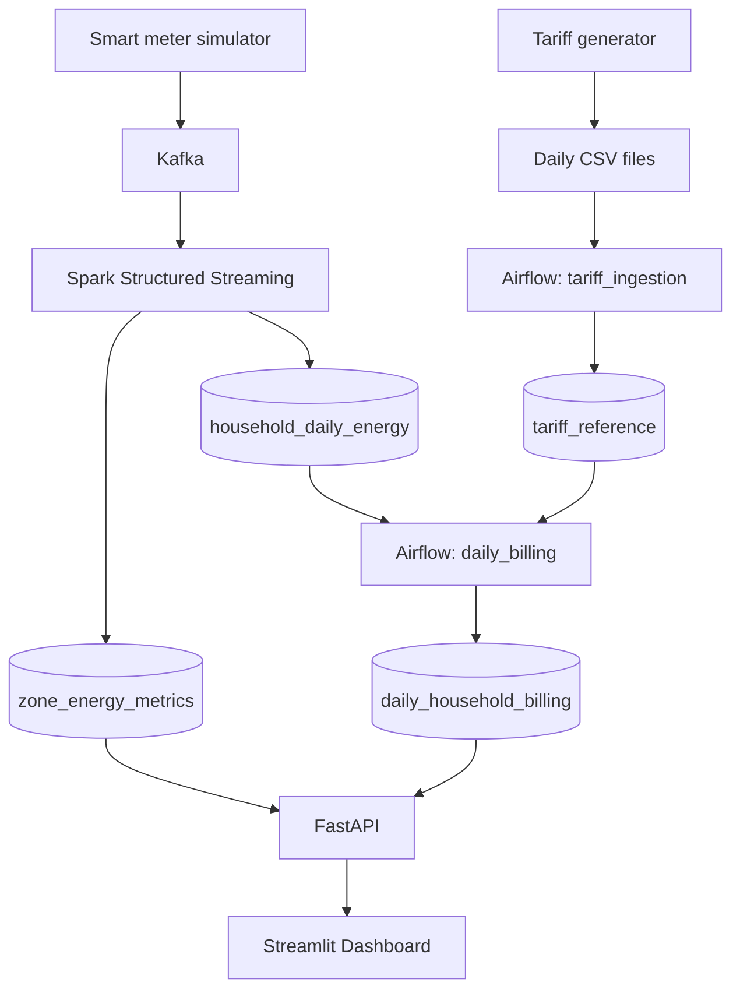

# Smart Grid Energy Monitoring & Billing Platform

A university data engineering mini-project that simulates household electricity
consumption and rooftop solar generation. It combines streaming grid monitoring
with daily tariff reconciliation and estimated household billing, served through
a small HTTP API. All household profiles and tariff rates are simulated;
they are **not official Sri Lankan electricity tariff rates**.

## Architecture



The four data tables live in PostgreSQL database `smart_grid`. Airflow keeps its
own metadata in `airflow_meta`. Docker Compose runs Kafka, Spark, PostgreSQL,
and Airflow. **FastAPI and the two producers currently run on the host.**

## Technology stack

| Tool | Purpose |
| --- | --- |
| Python / uv | Simulators, API, orchestration code, dependency management |
| Kafka 3.9.0 | Buffers JSON meter readings, keyed by household |
| Spark 3.5.1 | Validates events and computes event-time window aggregates |
| PostgreSQL 16 | Stores reference data, energy summaries, bills, and Airflow metadata |
| Airflow 3.3.1 (Docker) | Schedules tariff ingestion and daily billing |
| FastAPI | Exposes stored metrics and billing through HTTP and Swagger UI |
| Streamlit / Plotly / requests | Presents API data as interactive energy and billing charts |
| Docker Compose | Runs the infrastructure on one local network |

## Sources and simulation

Meter events contain `event_id`, `schema_version`, `meter_id`, `household_id`,
`power_consumption_kwh`, `solar_generation_kwh`, `grid_zone`, and `timestamp`.
Tariff CSV columns are `household_id`, `tariff_rate`, `billing_tier`,
`subsidy_flag`, and `effective_date`.

Current [configuration](config/config.yaml):

- 20 households across `ZONE-A`, `ZONE-B`, and `ZONE-C`; 13 have solar.
- One set of household readings approximately every real second.
- Start date: January 1, 2026. Speed: 288 simulated seconds per real second;
  one simulated day takes 300 real seconds (five minutes).
- Base loads: 0.15–0.45 kWh; solar capacities: 0.10–0.50 kWh per reading.
  Consumption has morning/evening peaks; solar follows a daylight sine curve.
- Seed 42 fixes solar-household selection only. Loads and weather vary randomly.
- Tariffs: 4 `SUBSIDIZED` households at 32 LKR/kWh, 12 `STANDARD` at 42,
  and 4 `PREMIUM` at 48. Only the subsidized tier has `subsidy_flag=true`.
- Tariff seed 42 makes household tier assignments reproducible across restarts.

Meter simulation parameters are loaded from YAML. The two generators have
independent clocks. Loads and weather are not seeded; reproducibility applies to
solar-household selection and tariff assignment, not the complete event stream.

## Calculations and storage

Spark rejects missing identifiers/timestamps and negative energy readings.

```text
household grid import = max(consumption - solar generation, 0)
renewable contribution (%) = round(total solar generation / total consumption * 100, 2)
estimated bill (LKR) = round(daily grid import * tariff rate, 2)
```

Spark rounds zone energy sums to three decimals before calculating the renewable
ratio and returns 0% if consumption is zero. The ratio can exceed 100%; it measures
generation relative to consumption, not solar actually consumed. Export is not
tracked. Billing casts the product to PostgreSQL numeric before rounding.
For example, 5 kWh consumption minus 2 kWh solar imports 3 kWh; 5 minus 8 imports
zero. Importing 10 kWh at 42 LKR/kWh yields an estimated bill of 420 LKR.

| Table | Grain and purpose |
| --- | --- |
| `zone_energy_metrics` | Zone + five-minute simulated-time window; energy totals, renewable ratio, reading count |
| `household_daily_energy` | Household + simulated date; daily totals and reading count |
| `tariff_reference` | Household + effective date; tariff, tier, and subsidy flag |
| `daily_household_billing` | Household + energy date; joined energy/tariff fields and estimated bill |

Both Spark queries use a ten-minute event-time watermark and append finalized
windows. A daily result needs events beyond the day boundary and watermark;
stopping the producer at exactly five minutes may leave the final day pending.
Spark checkpoints persist in `spark-checkpoints`. JDBC writes use append, not
upsert; replaying a committed batch can cause primary-key conflicts.

## Airflow

Both DAGs run every five real minutes with catchup disabled:

- `tariff_ingestion`: finds **all** tariff CSVs, validates columns, household
  count, duplicate household IDs, and nonnegative rates, then upserts tariffs.
- `daily_billing`: joins energy and tariffs on household and matching date,
  then upserts bills. Missing tariffs omit that household/date until a later run.

Both use `ON CONFLICT DO UPDATE`, so reruns update existing keys rather than
creating duplicate rows. They are independently scheduled; billing may need the
next run if tariff ingestion finishes later. Airflow uses `standalone` for this
local demo, with PostgreSQL metadata rather than SQLite.

## API

Base URL: `http://127.0.0.1:8000`. These are the implemented GET endpoints:

| URL example | Result |
| --- | --- |
| `/health` | Database connectivity; 200 when healthy, 503 on failure |
| `/api/v1/zones/latest` | Latest stored window per zone |
| `/api/v1/zones/history?limit=100` | Recent zone rows in chronological order; limit 1–1000 |
| `/api/v1/billing/daily?billing_date=2026-01-01` | Bills for a date; 404 if absent, 422 for an invalid/missing date |
| `/api/v1/households/HH-001/billing` | Household billing history; 404 if absent |

Household IDs are currently arbitrary strings; malformed IDs with no matching
rows return 404 rather than a format-validation error.

### Renewable alerts

`GET /api/v1/alerts/renewable` reads the most recent stored window per zone.
It returns `{"threshold_pct": 20, "alerts": [...]}`; each alert contains
`grid_zone`, `renewable_contribution_pct`, `status: "LOW_RENEWABLE"`, and `window_end`.
A value strictly below 20% triggers an alert only when the stored `window_end`
hour is in **06:00 <= hour < 18:00**. Threshold and hours come from YAML.
Nighttime is ignored because low solar generation is expected. No matches returns
an empty list. Alerts are evaluated on request, with structured INFO/WARNING logs;
they are not persisted or pushed as notifications. Latest stored data may be stale.
FastAPI remains host-run.

## Run locally

Use Docker Desktop with Linux containers, Python 3.12+, and uv. Commands below
run from the repository root in PowerShell.

```powershell
uv sync
docker compose up -d postgres kafka
```

For a **new installation only**, check whether the separate metadata database
exists, then create it if the query returns no rows:

```powershell
docker exec smart-grid-postgres psql -U smartgrid -d postgres -tAc "SELECT datname FROM pg_database WHERE datname = 'airflow_meta';"
docker exec smart-grid-postgres createdb -U smartgrid airflow_meta
```

Skip `createdb` on an existing installation. `database/init.sql` initializes
business tables only when the PostgreSQL data volume is first created.

```powershell
docker compose up -d --build
docker exec smart-grid-airflow airflow dags list
docker exec smart-grid-airflow airflow dags unpause tariff_ingestion
docker exec smart-grid-airflow airflow dags unpause daily_billing
```

Allow initial Spark connector downloads and Airflow DAG discovery to complete
before unpausing. Start the following in three separate terminals on a fresh run:

```powershell
uv run python -m src.producers.smart_meter_producer
uv run python -m src.producers.tariff_generator
uv run uvicorn src.api.main:app --reload
```

Start both producers close together and keep the meter producer running beyond
one day to finalize daily summaries. Airflow then loads tariffs and calculates
bills. Press Ctrl+C to stop each host process.

**Existing data:** both producers restart from January 1. The tariff generator
overwrites files with matching dates and may replace historical profiles generated before the fixed seed was added. For an existing
submission/demo dataset, use the read-only [demo checklist](docs/demo-checklist.md)
instead of restarting generators. Do not delete volumes or checkpoints to retry.

Host PostgreSQL is `127.0.0.1:5433` (avoids native Windows PostgreSQL on 5432);
containers use `postgres:5432`. **Local demo credentials** are `smartgrid` / `smartgrid`.
The config loader caches YAML per process: restart host processes after changing it.

Useful URLs:

- Swagger UI: http://127.0.0.1:8000/docs
- Health: http://127.0.0.1:8000/health
- Airflow UI: http://localhost:8080

Airflow standalone stores generated login passwords inside its volume. To view
them locally (do not include them in screenshots or submissions):

```powershell
docker exec smart-grid-airflow cat /opt/airflow/simple_auth_manager_passwords.json.generated
```

## Dashboard

The host-run Streamlit dashboard reads **FastAPI → Streamlit**, with no direct
database connection. It shows energy KPI cards, consumption/solar/grid trends,
zone comparisons, renewable contribution and API-provided alerts, plus daily
household bills and average bills by tariff tier. All data is simulated.

Start FastAPI first, then open another terminal:

```powershell
uv run streamlit run dashboard/app.py
```

Open http://localhost:8501. Select a billing date (default January 1, 2026), and
use **Refresh Dashboard** to clear the 15-second cache. No automatic polling is
performed. The trend chart shows up to 100 windows from 300 recent zone rows;
partial windows and differing latest zone times are flagged. Simulated timestamps
are shown explicitly, and API health does not imply the pipeline is producing
new data. Missing billing dates and unavailable services show friendly messages.

To use another API address, set it before starting Streamlit:

```powershell
$env:SMART_GRID_API_URL = "http://127.0.0.1:8000"
```

Dependencies: Streamlit for the page, Plotly for interactive charts, requests for
HTTP calls with five-second timeouts. Billing and alert decisions remain in the
backend; the dashboard only aggregates returned data for presentation.

## Tests and validation

```powershell
uv run pytest
```

Tests use mocked API database connections and temporary CSV files; no Docker,
PostgreSQL, Kafka, or Java runtime is needed. They cover config loading, API
validation and failures, consumption/solar patterns, tariff reproducibility, and renewable alert daylight/threshold boundaries.
Spark expressions and billing SQL remain in their existing engines; the unit
suite does not claim to execute those calculations. See
[validation commands](docs/validation.md) for read-only database checks.

Open PostgreSQL with:

```powershell
docker exec -it smart-grid-postgres psql -U smartgrid -d smart_grid
```

```sql
SELECT COUNT(*) FROM zone_energy_metrics;
SELECT energy_date, COUNT(*) FROM household_daily_energy GROUP BY energy_date ORDER BY energy_date;
SELECT effective_date, COUNT(*) FROM tariff_reference GROUP BY effective_date ORDER BY effective_date;
SELECT COUNT(*) FROM daily_household_billing;
```

Use `\q` to exit. See the [5–10 minute demo checklist](docs/demo-checklist.md).
