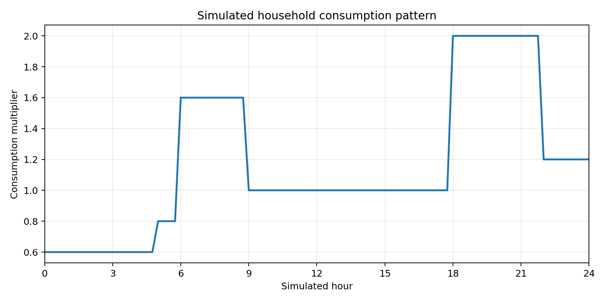
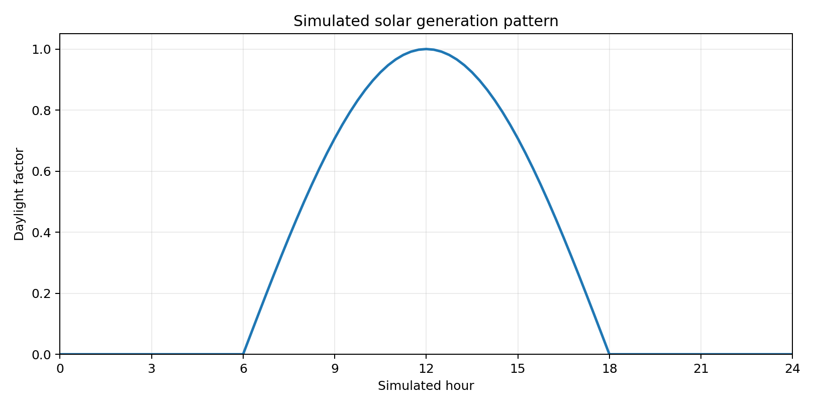

# Producer Simulation Guide

This folder contains the Python scripts that simulate the data sources for the **Smart Grid Data Platform**.

The goal is not to reproduce real electricity behaviour exactly. The simulator creates simple, understandable patterns that are useful for testing Kafka, Spark streaming, billing, and dashboard logic.

## Smart Meter Producer

`smart_meter_producer.py` simulates electricity readings from multiple households and publishes them to Kafka.

Each household has:

- `household_id`
- `meter_id`
- `grid_zone`
- `base_load`
- optional `solar_capacity`

## Household Setup

Each household receives a base electricity load.

```text
base_load = random value between 0.15 and 0.45 kWh
```

A fixed number of households are selected to have solar panels.

```python
NUMBER_OF_SOLAR_HOUSES = 13
RANDOM_SEED = 42
```

The selection is random, but the fixed seed makes the **same households receive solar panels every time the simulator starts**.

Households without solar:

```text
solar_capacity = 0
```

Solar households receive:

```text
solar_capacity = random value between 0.1 and 0.5 kWh
```

---

## Consumption Simulation

Household consumption is calculated as:

```text
consumption =
    base_load
    × time_of_day_multiplier
    × random_variation
```

The random variation is between:

```text
0.85 - 1.15
```

This prevents every reading from being identical.

### Daily consumption pattern



| Simulated time | Multiplier | Behaviour |
|---|---:|---|
| 00:00-05:00 | 0.6 | Low night usage |
| 05:00-06:00 | 0.8 | Early morning |
| 06:00-09:00 | 1.6 | Morning peak |
| 09:00-18:00 | 1.0 | Normal daytime usage |
| 18:00-22:00 | 2.0 | Evening peak |
| 22:00-24:00 | 1.2 | Late evening |

The graph shows the **base pattern before random variation is applied**.

---

## Solar Generation Simulation

Solar generation is calculated only for households that have solar panels.

```text
solar_generation =
    solar_capacity
    × daylight_factor
    × weather_variation
```

Weather variation is simulated between:

```text
0.75 - 1.0
```

### Daily solar pattern



The simplified solar behaviour is:

```text
00:00-06:00  -> no solar generation
06:00-12:00  -> generation increases
around 12:00 -> highest generation
12:00-18:00  -> generation decreases
18:00-24:00  -> no solar generation
```

The graph shows the **normalized daylight factor**. Actual generation also depends on each household's solar capacity and the random weather variation.

---

## Consumption vs Solar During a Day

The simulator is designed to create this general behaviour:

```text
Time       Consumption                 Solar
-------------------------------------------------------
00-05      Low                         None
06-09      Morning peak                Increasing
09-12      Normal                      Increasing
12         Normal                      Near maximum
12-18      Normal                      Decreasing
18-22      Evening peak                None
22-24      Moderate                    None
```

This gives the streaming pipeline useful patterns to detect, such as:

- morning and evening demand peaks,
- changing renewable contribution during daylight hours,
- high grid dependency at night,
- different behaviour between solar and non-solar households.

---

## Simulated Time

The simulator uses an accelerated clock:

```text
5 real minutes = 1 simulated day
```

So a complete daily consumption and solar cycle can be demonstrated quickly.

---

## Kafka Event

Each reading is published to the Kafka topic:

```text
smart-meter-readings
```

Example:

```json
{
  "event_id": "unique-event-id",
  "schema_version": 1,
  "meter_id": "METER-001",
  "household_id": "HH-001",
  "power_consumption_kwh": 0.42,
  "solar_generation_kwh": 0.18,
  "grid_zone": "ZONE-A",
  "timestamp": "2026-01-01T12:00:00+00:00"
}
```

The Kafka message key is `household_id` so readings from the same household are consistently partitioned.

---

## Main Assumptions

- All values are simulated and simplified for demonstration.
- Household base loads are randomly assigned within a configured range.
- A fixed number of households have solar panels.
- A fixed random seed keeps solar-household selection reproducible.
- Solar generation depends mainly on simulated time of day.
- Weather variation introduces small changes in solar output.
- Consumption follows a simplified daily usage pattern.
- Grid zones are distributed across households.
